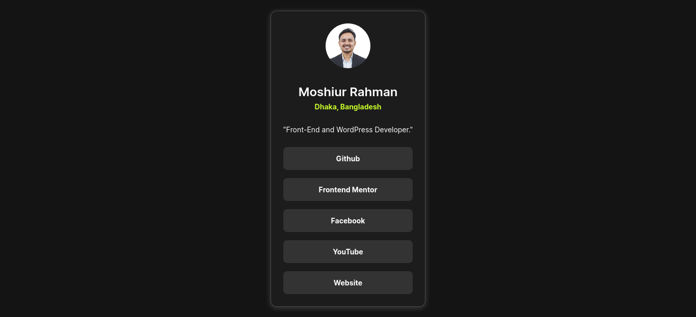
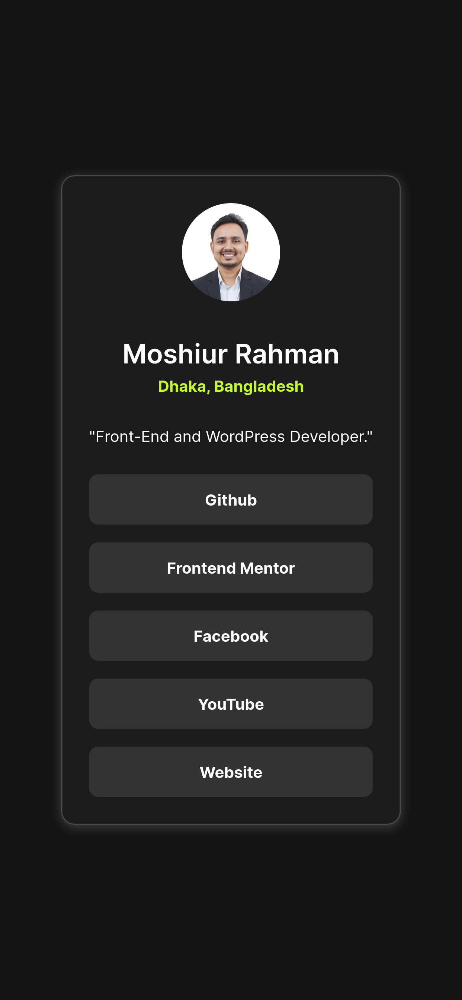

# Frontend Mentor - Social links profile

## Overview

### Screenshot

#### Desktop

#### Mobile

### Links

- Solution URL: 
- Live Site URL: [https://codermoshiur.github.io/social-links-profile/](https://codermoshiur.github.io/social-links-profile/)

## My process

### Built with

- Semantic HTML5 markup
- CSS custom properties
- CSS Grid
- Mobile-first workflow

## Author

- Website - [Moshiur](https://codersfoundation.com)
- Youtube - [@moshiur](https://www.youtube.com/moshiur)
- Facebook - [@codermoshiur](https://www.facebook.com/codermoshiur)
- Frontend Mentor - [@codermoshiur](https://www.frontendmentor.io/profile/codermoshiur)
